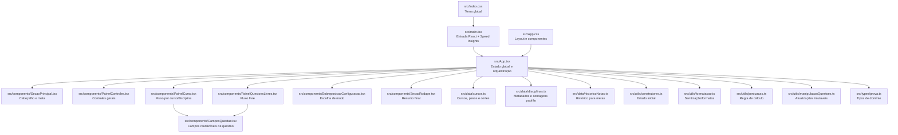

# Arquitetura da Calculadora

Diagrama de responsabilidades dos arquivos principais.

## Resumo rápido
- `App.tsx` é o núcleo da lógica.
- `components/` cuida da interface e interação.
- `data/` centraliza dados e parsing.
- `utils/` contém regras reutilizáveis e manipulação de estado.
- `types/prova.ts` define o contrato de tipos da aplicação.
